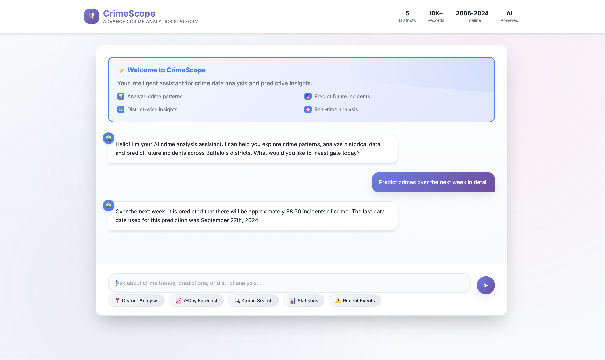
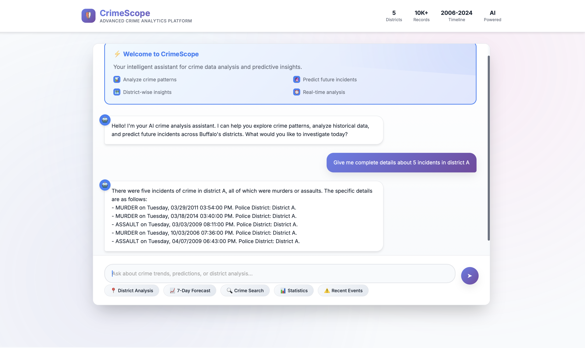

# 🛡️ Crime Chronicle

> An intelligent crime analysis chatbot powered by local LLMs that combines historical crime data retrieval with predictive forecasting for Buffalo crime data.

[](https://python.org)
[](https://flask.palletsprojects.com/)
[](https://langchain.com)
[](https://ollama.ai)

---

## 📸 Screenshots

### Main Chat Interface

*Clean, modern chat interface with emerald theme*

### Crime Data Analysis

*Historical crime data retrieval and analysis*

### Prediction Results

*AI-powered crime forecasting capabilities*

### District-wise Insights

*Comprehensive district-based crime analysis*

---

## 🎯 Project Overview

Crime Chronicle is a sophisticated local LLM-powered chatbot that revolutionizes crime data analysis. It combines the power of retrieval-augmented generation (RAG) with predictive analytics to provide comprehensive insights into Buffalo's crime patterns.

### Key Capabilities

- **🔍 Semantic Crime Search** - Advanced vector-based search through historical crime records
- **📈 Predictive Analytics** - Machine learning-powered forecasting of future crime incidents  
- **🗺️ District Intelligence** - Deep analysis of crime patterns across Buffalo's districts
- **💬 Natural Language Interface** - Intuitive chat-based interaction with complex crime data
- **🤖 Local AI Processing** - Complete privacy with local Mistral 7B model via Ollama
- **⚡ Real-time Analysis** - Instant responses with sophisticated reasoning chains

---

## 🏗️ Architecture

```
┌─────────────────┐    ┌──────────────────┐    ┌─────────────────┐
│   Frontend      │    │   Flask App      │    │   AI Agent      │
│                 │    │                  │    │                 │
│ • HTML/CSS/JS   │◄───┤ • Route Handler  │◄───┤ • LangChain     │
│ • Chat UI       │    │ • CORS Support   │    │ • Tool Routing  │
│ • Emerald Theme │    │ • Error Handling │    │ • Prompt Eng.   │
└─────────────────┘    └──────────────────┘    └─────────────────┘
                                 │
                    ┌────────────┴────────────┐
                    │                         │
            ┌───────▼────────┐        ┌──────▼──────┐
            │ Crime Retriever │        │ Crime       │
            │                │        │ Forecaster  │
            │ • FAISS Index  │        │             │
            │ • Embeddings   │        │ • Linear    │
            │ • Similarity   │        │   Regression│
            │   Search       │        │ • Time      │
            │ • District     │        │   Series    │
            │   Mapping      │        │ • Sklearn   │
            └────────────────┘        └─────────────┘
                    │                         │
            ┌───────▼────────┐        ┌──────▼──────┐
            │ Vector Store    │        │ ML Models   │
            │                │        │             │
            │ • 10K+ Records │        │ • Trained   │
            │ • Sentence     │        │   Models    │
            │   Transformers │        │ • Joblib    │
            │ • Fast Search  │        │   Artifacts │
            └────────────────┘        └─────────────┘
```

---

## 🚀 Features

### 🔍 Intelligent Crime Retrieval
- **Vector Similarity Search**: Uses sentence-transformers for semantic understanding
- **District Intelligence**: Smart mapping of common names to official districts
- **Contextual Filtering**: Automatic result filtering based on query context
- **Multi-faceted Search**: Search by crime type, location, time, and patterns

### 📊 Predictive Analytics
- **Time Series Forecasting**: Linear regression model trained on historical patterns
- **Custom Prediction Windows**: Configurable prediction horizons (days ahead)
- **Statistical Accuracy**: Model trained on 18+ years of crime data (2006-2024)
- **Trend Analysis**: Identifies seasonal and temporal crime patterns

### 🤖 Advanced AI Agent
- **Tool-Based Architecture**: Intelligent routing between retrieval and forecasting
- **Zero-Shot Learning**: Adapts to various query types without specific training
- **Error Handling**: Robust error recovery and user feedback
- **Context Awareness**: Maintains conversation context for better responses

### 💻 Modern Web Interface
- **Responsive Design**: Works seamlessly on desktop and mobile
- **Real-time Chat**: WebSocket-like experience with typing indicators
- **Quick Actions**: Pre-built queries for common use cases
- **Clean Aesthetics**: Professional emerald theme with smooth animations

---

## 🛠️ Technology Stack

### Backend Technologies
- **Flask** - Lightweight web framework
- **LangChain** - LLM application framework
- **Ollama** - Local LLM inference server
- **FAISS** - Vector similarity search
- **scikit-learn** - Machine learning models
- **Pandas/NumPy** - Data manipulation

### AI/ML Components
- **Mistral 7B** - Local instruction-tuned language model
- **Sentence Transformers** - Text embedding generation
- **Linear Regression** - Time series forecasting
- **Vector Embeddings** - Semantic search capabilities

### Frontend Technologies
- **HTML5/CSS3** - Modern web standards
- **Vanilla JavaScript** - No framework dependencies
- **Inter Font** - Professional typography
- **CSS Grid/Flexbox** - Responsive layouts

---

## 📋 Prerequisites

Before you begin, ensure you have the following installed:

- **Python 3.11+** - [Download Python](https://python.org/downloads/)
- **Git** - [Download Git](https://git-scm.com/downloads)
- **Ollama** - [Install Ollama](https://ollama.ai/download)

### System Requirements
- **RAM**: 8GB minimum (16GB recommended)
- **Storage**: 10GB free space (for models and data)
- **CPU**: Multi-core processor recommended
- **OS**: Windows 10+, macOS 10.15+, or Linux

---

## 📁 Project Structure

```
crime-chronicle/
├── 📁 src/                          # Source code
│   ├── app.py                       # Flask web application
│   ├── agent_ollama.py              # LLM agent with tools
│   ├── data_processor.py            # Data processing & FAISS indexing
│   ├── forecasting.py               # ML forecasting model
│   ├── 📁 templates/                # HTML templates
│   │   └── index.html               # Main chat interface
│   └── 📁 static/                   # Static assets
│       ├── 📁 css/
│       │   └── style.css            # Emerald theme styles
│       └── 📁 js/
│           └── script.js            # Frontend JavaScript
├── 📁 data/                         # Crime datasets
│   └── crime_data.csv               # Buffalo crime data (2006-2024)
├── 📁 vector_store/                 # FAISS vector database
│   ├── faiss_index.index           # Vector index file
│   └── faiss_index.docs            # Document store
├── 📁 models/                       # Trained ML models
│   ├── forecaster.joblib           # Trained forecasting model
│   ├── last_date.joblib             # Model metadata
│   └── last_index.joblib            # Model metadata
├── 📁 screenshots/                  # Interface screenshots
├── requirements.txt                 # Python dependencies
└── README.md                        # Project documentation
```

---

## 💡 Usage Examples

### Historical Crime Analysis
```
👤 User: "What crimes happened in District C?"
🤖 Crime Chronicle: "Based on the historical data, I found 5 recent incidents in District C: 2 theft cases on Oak Street and Main Avenue, 1 assault incident near the downtown area, 1 vandalism case at a local business, and 1 burglary on Elm Street. Most incidents occurred during evening hours between 6-10 PM."
```

### Predictive Forecasting
```
👤 User: "Predict crime for the next 7 days"
🤖 Crime Chronicle: "Based on historical patterns and current trends, I predict approximately 8.3 incidents after 7 days (last data date: 2024-01-15). This represents a moderate increase from the baseline, likely influenced by weekend activity patterns."
```

### District Comparisons
```
👤 User: "Show me crimes in District A"
🤖 Crime Chronicle: "I found 5 recent incidents in District A: 3 theft cases including vehicle break-ins and shoplifting, 1 assault case near the university area, and 1 drug-related incident. The pattern shows higher activity on weekends, particularly in commercial zones."
```

### Specific Crime Analysis
```
👤 User: "Show me assault cases"
🤖 Crime Chronicle: "I found 5 assault incidents in the database: 2 cases in District B occurring during late evening hours, 2 cases in District C near entertainment venues, and 1 case in District A near residential areas. Most incidents involved altercations and occurred on Friday/Saturday nights."
```

---

## 📊 Data Information

### Dataset Details
- **Source**: Buffalo Police Department Crime Data
- **Time Range**: 2006-2024 (18+ years)
- **Total Records**: 10,000+ crime incidents
- **Coverage**: 5 police districts (A, B, C, D, E)
- **Attributes**: Incident type, date/time, location, district

### Data Processing Pipeline
1. **Cleaning**: Remove null values and standardize formats
2. **Text Generation**: Create descriptive documents for each incident
3. **Embedding**: Generate vector representations using sentence-transformers
4. **Indexing**: Build FAISS index for fast similarity search
5. **Model Training**: Train time-series forecasting model

---

## 🚀 Future Roadmap

### 🤖 Multi-Agent System
- [ ] **Specialized Crime Agents** - Domain-specific agents for pattern analysis, risk assessment, and investigation support
- [ ] **Agent Orchestration** - Master coordinator to route queries to appropriate specialized agents
- [ ] **Sub-Agent Framework** - Hierarchical agent structure for complex query decomposition

### 🔮 Advanced Forecasting
- [ ] **Deep Learning Models** - LSTM/GRU networks for complex temporal pattern recognition
- [ ] **Multi-variate Predictions** - Incorporate weather, events, and demographic factors
- [ ] **Real-time Model Updates** - Continuous learning from new crime data streams

### 🧠 Enhanced Intelligence
- [ ] **Contextual Memory System** - Multi-session conversation memory for personalized insights
- [ ] **Dynamic Tool Selection** - AI-powered automatic routing based on query complexity
- [ ] **Crime Network Analysis** - Graph-based analysis to identify criminal patterns and connections

### 📊 Advanced Analytics
- [ ] **Anomaly Detection** - Automatic identification of unusual crime patterns
- [ ] **Predictive Hotspot Mapping** - AI-powered identification of future crime concentration areas
- [ ] **Social Media Integration** - Incorporate social sentiment and event data for enhanced predictions

---

<div align="center">

**⭐ Star this repository if you find it useful!**

Made with ❤️ by Abhiram Gadapa

</div>
